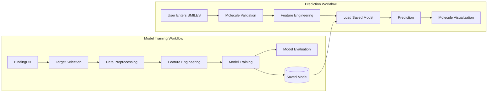

#Lightning Cheminformatics Starter ReadMe
Objective - Build an application for predicting chemical properties using Lighting AI's Studio.

## Application Architecture

This project converts a notebook-based cheminformatics workflow into a configurable machine learning application hosted in Lightning AI Studio.

## Project Structure

The project follows a modular architecture that separates data retrieval, feature engineering, model development, and application deployment.

| Directory         | Purpose                                                                                                   |
| ----------------- | --------------------------------------------------------------------------------------------------------- |
| `notebooks/`      | Original Practical Cheminformatics tutorial and exploratory analyses                                      |
| `src/`            | Reusable Python modules for data processing, feature engineering, modeling, prediction, and visualization |
| `data/raw/`       | Raw datasets downloaded from BindingDB                                                                    |
| `data/processed/` | Cleaned and feature-engineered datasets                                                                   |
| `models/`         | Trained machine learning models                                                                           |
| `images/`         | Figures and screenshots used in documentation                                                             |
| `app.py`          | Streamlit application for training and serving QSAR models                                                |
| `journal.md`      | Development notes, Git commands, and Lightning AI learning journal                                        |

### Source Modules

| Module             | Responsibility                                      |
| ------------------ | --------------------------------------------------- |
| `bindingdb.py`     | Query and retrieve BindingDB data                   |
| `preprocessing.py` | Clean and transform assay data (e.g., EC50 → pEC50) |
| `featurize.py`     | Generate molecular descriptors and fingerprints     |
| `modeling.py`      | Train and evaluate machine learning models          |
| `predict.py`       | Load trained models and generate predictions        |
| `visualize.py`     | Molecular rendering and model evaluation plots      |
| `utils.py`         | Shared helper functions                             |
