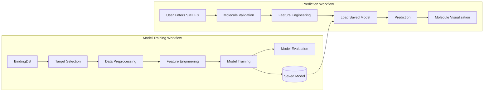

# Lightning Cheminformatics Starter

A portfolio project demonstrating how to transform a notebook-based cheminformatics workflow into a deployable machine learning application using Lightning AI.

The project begins with the Building a Machine Learning Model with [BindingDB tutorial](https://colab.research.google.com/github/PatWalters/practical_cheminformatics_tutorials/blob/main/bindingdb/binding_db_pxr_tutorial.ipynb) from [Practical Cheminformatics](https://patwalters.github.io/) and extends it into a configurable application that enables users to:

- Query BindingDB for a protein target
- Engineer molecular features
- Configure and train machine learning models
- Save trained models
- Predict molecular activity from user-provided SMILES
- Deploy and serve the application using Lightning AI

## Project Goals
This repository is designed to explore the complete lifecycle of a scientific machine learning application.

Specifically, the project demonstrates:

Running Jupyter notebooks inside Lightning AI Studio
Refactoring notebook code into reusable Python modules
Building reproducible cheminformatics workflows
Training and evaluating QSAR models
Serving trained models through an interactive Streamlit application
Deploying scientific applications on Lightning AI

## Scientific Workflow
This project follows the Practical Cheminformatics philosophy of beginning with an exploratory notebook before progressively converting the workflow into reusable software components.

The workflow evolves through four stages:

Explore data and train an initial model in a notebook.
Refactor notebook code into reusable Python modules.
Build an interactive application around the trained model.
Deploy the application using Lightning AI Studio.

## Application Architecture

This project converts a notebook-based cheminformatics workflow into a configurable machine learning application hosted in Lightning AI Studio.

## Project Structure

The project follows a modular architecture that separates data retrieval, feature engineering, model development, and application deployment.

| Directory         | Purpose                                                                                                   |
| ----------------- | --------------------------------------------------------------------------------------------------------- |
| `notebooks/`      | Original Practical Cheminformatics tutorial and exploratory analyses                                      |
| `src/`            | Reusable Python modules for data processing, feature engineering, modeling, prediction, and visualization |
| `data/raw/`       | Raw datasets downloaded from BindingDB                                                                    |
| `data/processed/` | Cleaned and feature-engineered datasets                                                                   |
| `models/`         | Trained machine learning models                                                                           |
| `images/`         | Figures and screenshots used in documentation                                                             |
| `app.py`          | Streamlit application for training and serving QSAR models                                                |
| `journal.md`      | Development notes, Git commands, and Lightning AI learning journal                                        |

### Source Modules

| Module             | Responsibility                                      |
| ------------------ | --------------------------------------------------- |
| `bindingdb.py`     | Query and retrieve BindingDB data                   |
| `preprocessing.py` | Clean and transform assay data (e.g., EC50 → pEC50) |
| `featurize.py`     | Generate molecular descriptors and fingerprints     |
| `modeling.py`      | Train and evaluate machine learning models          |
| `predict.py`       | Load trained models and generate predictions        |
| `visualize.py`     | Molecular rendering and model evaluation plots      |
| `utils.py`         | Shared helper functions                             |

## Technology Stack

| Component | Technology |
|-----------|------------|
| Development Environment | Lightning AI Studio |
| Notebook Environment | Jupyter / VS Code |
| Programming Language | Python |
| Cheminformatics | RDKit |
| Data Processing | pandas |
| Machine Learning | scikit-learn, LightGBM |
| Dataset | BindingDB |
| User Interface | Streamlit |
| Version Control | Git + GitHub |

---

## Repository Roadmap

| Phase | Status | Description |
|-------|:------:|-------------|
| Environment Setup | ✅ | Configure Lightning AI Studio and GitHub |
| Tutorial Reproduction | 🚧 | Reproduce the Practical Cheminformatics BindingDB notebook |
| Modular Refactor | ⏳ | Convert notebook code into reusable Python modules |
| Streamlit Application | ⏳ | Build an interactive model training and prediction interface |
| Lightning Deployment | ⏳ | Deploy the application through Lightning AI |

## Learning Journal
Development notes, Git tips, and observations from building this project are maintained in journal.md.

## Acknowledgements
This project builds upon the excellent Practical Cheminformatics tutorials created by Pat Walters.

Rather than reproducing the tutorial verbatim, this repository explores how notebook-based scientific workflows can be transformed into reusable, deployable applications suitable for modern AI-driven research.