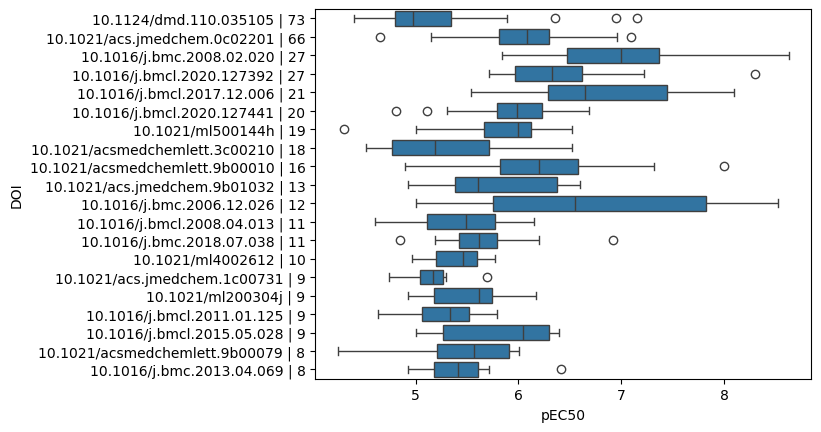
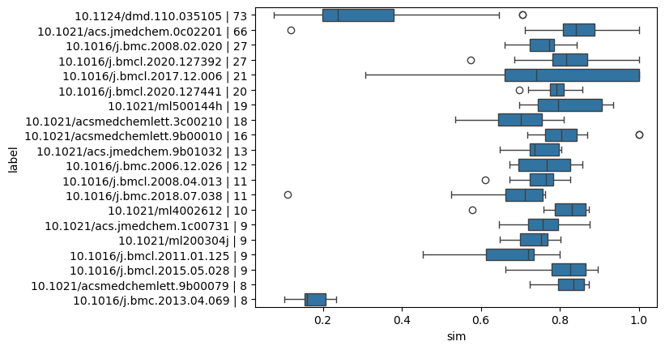

# Scientific Objective
Build a model that predicts top binders for Pregnane X Receptor (PXR) from BindingDB data 
PXR is a mediator of xenobiotic metabolism and is a master regulartor of lipophilic compounds
PXR coodrinates CYP3A4 enzymes as drug transporters like P-glycoprotein
PXR activation is a liability in drug discovery context. PXR agonist (activators) induce metabolism of itself or co-administered drugs which results in drug-drug interactions (DDIs), reduced efficacy, and production of toxic metabolites
PXR screening is a standard practice to optimize metabolic stability and safety profiles of clinical candidates

Using PXR UnitProt ID, 075469, you can query BindingDB to retrieve all compounds with PXR screening data
# Inputs
## Data Source
BindingDB subset database. Full DB is 2GB+ so the demo uses a smaller subset
''' python
file_path = Path("bindingdb_sample.ddb")

if not file_path.exists():
    url = "https://raw.githubusercontent.com/PatWalters/practical_cheminformatics_tutorials/refs/heads/main/bindingdb/bindingdb_sample.ddb"
    fiiename = wget.download(url)
'''
*Note* - THis is a subset database so we should have a UnitPro exploration to determine what protein codes are available with sufficient data for training.
## Duck DB SQL Query
Execute SQL query on DuckDB structure to retrieve target uniprot_id
''' SQL
query = f"""select "Ligand SMILES","Ligand InChI Key",
    "BindingDB Ligand Name",
    "Target Name", 
    "Target Source Organism According to Curator or DataSource",
    "Article DOI", 
    "PDB ID(s) for Ligand-Target Complex",
    "EC50 (nM)" from bindingdb 
    where "UniProt (SwissProt) Primary ID of Target Chain 1" = '{uniprot_id}'"""
    '''

## Data Preprocessing & Feature Engineering
Perform 3 tasks
1. Create boolean to flag colums with > or < operators
2. Filter rows without EC50s
3. Conver EC50 from nanomolar to -log10 of molar concentration

## Data Exploration
View number of compounds for each paper, distributions of EC50s, chemical diversity using tanimoto similarity,

'''python
def get_max_tanimoto_similarities(smiles_list, radius=2, nBits=2048):
    """
    Calculates the maximum Tanimoto similarity for each molecule 
    compared to all other molecules in the provided SMILES list
    using the modern MorganGenerator.
    """
    # 1. Convert SMILES to RDKit Mol objects
    mols = [Chem.MolFromSmiles(s) for s in smiles_list]
    valid_mols = [m for m in mols if m is not None]
    
    if not valid_mols:
        return []

    # 2. Initialize the Morgan Fingerprint Generator
    # Note: radius=2 in the old method corresponds to fpSize=2 in the generator
    generator = rdFingerprintGenerator.GetMorganGenerator(radius=radius, fpSize=nBits)
    
    # 3. Generate fingerprints
    fps = [generator.GetFingerprint(m) for m in valid_mols]
    
    max_similarities = []
    
    # 4. Compare each fingerprint against all others
    for i, fp_target in enumerate(fps):
        # Using BulkTanimotoSimilarity for better performance
        others = fps[:i] + fps[i+1:]
        
        if not others:
            max_similarities.append(0.0)
            continue
            
        sims = DataStructs.BulkTanimotoSimilarity(fp_target, others)
        max_similarities.append(max(sims))
        
    return max_similarities
    '''

## Locate Structures
Determine which compounds have structures for Ligand-PXR binding
''' python
pxr_id_list = get_pdb_ids(uniprot_id)
pxr_id_set = set([x.upper() for x in pxr_id_list])
'''
Add PDB Column
'''python
pxr_pdb_list = []
for r in res_df["PDB ID(s) for Ligand-Target Complex"]:
    if r is None:
        pxr_pdb_list.append(None)
    else:
        id_list = r.split(",")
        ok_list = [x for x in id_list if x in pxr_id_set]
        if len(ok_list):
            pxr_pdb_list.append(ok_list)
        else:
            pxr_pdb_list.append(None)
res_df['pxr_pdb'] = pxr_pdb_list
xray_df = res_df.dropna(subset="pxr_pdb")[["Ligand SMILES","Article DOI","pxr_pdb"]].dropna().drop_duplicates(subset="Article DOI")
'''
### EC50 Aggregation
Create a single representative EC50 for each compound
'''python
res_df_ok = res_df.query("has_operator == False").copy()
ligand_count_df = uru.value_counts_df(res_df_ok,"Ligand InChI Key")
ligand_count_df.sort_values("count",ascending=False,inplace=True)
'''

Perform aggregation
'''python
agg_list = []
for k,v in res_df_ok.groupby("Ligand InChI Key"):
    mean_val = v.pEC50.values.mean()
    smiles = v["Ligand SMILES"].values[0]
    agg_list.append([smiles,mean_val])
agg_df = pd.DataFrame(agg_list,columns=["SMILES","pEC50"])
'''

## Prepare QSAR
### Calculate RDKit Descriptors
'''python
rdkit_desc = uru.RDKitDescriptors()
agg_df['desc'] = agg_df["SMILES"].progress_apply(rdkit_desc.calc_smiles)
'''
Split data
'''python
train, test = train_test_split(agg_df)
'''

### Model Training
Train LightGBM regression model
'''python
lgbm = LGBMRegressor(verbose=-1)
lgbm.fit(np.stack(train.desc),train.pEC50)
with warnings.catch_warnings():
    warnings.simplefilter("ignore")
    pred = lgbm.predict(np.stack(test.desc))
'''
### Evaluate Model Performance using R-Squared
'''python
r2 = r2_score(test.pEC50,pred)
r2
'''

### Perform multiple training iterations
Randomly split data into different training/test sets and train a new lightGBM regression model and calculate R-square for each new test set. This provides insights into how data generalizes
'''python
r2_list = []
for i in tqdm(range(0,10)):
    train, test = train_test_split(agg_df)
    lgbm = LGBMRegressor(verbose=-1)
    lgbm.fit(np.stack(train.desc),train.pEC50)
    with warnings.catch_warnings():
        warnings.filterwarnings("ignore",category=UserWarning)
        pred = lgbm.predict(np.stack(test.desc))    
    r2 = r2_score(test.pEC50,pred)
    r2_list.append(r2)
'''

# Outputs

## DuckDB SQL Query
Returns raw table
## Preprocessing
Returns clean table with target engineered features

## Data Exploration
Tables and graphs.
EC50 Distributions: 
'''python
assay_df_list = []
y_label_list = []
for doi in ref_count_df["Article DOI"].head(20):
    doi_df = res_df.query("`Article DOI`== @doi")  
    agg_df = aggregate_data(doi_df)
    label = f"{doi} | {len(agg_df)}"
    agg_df['label'] = label
    y_label_list.append([label,len(agg_df)])
    assay_df_list.append(agg_df) 
combo_df = pd.concat(assay_df_list).reset_index(drop=True)
y_label_df = pd.DataFrame(y_label_list,columns=["label","count"]).sort_values("count",ascending=False)
ax = sns.boxplot(x="pEC50",y="label",data=combo_df,order=y_label_df.label)
ax.set_ylabel("DOI");
'''

Tanimoto Similarity Boxplots

'''python
sns.boxplot(x="sim",y="label",data=sim_combo_df,order=y_label_df.label)
'''
## Locate Structures
Visualize ligands with structures and PDB
'''python
mols2grid.display(xray_df,smiles_col="Ligand SMILES",subset=["img","pxr_pdb"])
'''

## Plot EC50 Variability
'''python
figure, axes = plt.subplots(1,5,figsize=(10,2.5),sharex=True,sharey=True)
for i,inchi in enumerate(ligand_count_df.head(5)["Ligand InChI Key"]):
    vals = res_df_ok.query("`Ligand InChI Key` == @inchi").pEC50.values
    ax = sns.pointplot(vals,ax=axes[i])
    ax.set_label("Sample #")
    ax.set_ylabel("pEC50 PXR")
plt.tight_layout()
'''

plot distribution as histogram
'''python
sns.displot(agg_df.pEC50)
'''

## Prepare QSAR
### RDKit Descriptors
descriptors are added to df for selected compounds
Dataset is split into training and validation datasets.

### Model Training
New model for inferencing
Visualize validation using predicted vs actual ec50 plot
'''python
ax = sns.regplot(x=test.pEC50,y=pred)
ax.text(4,7,f"$R^2$={r2:.2f}");
'''

### Perform Multiple Training Splits
Plot distributions of R-Square based on data training split
'''python
ax = sns.pointplot(r2_list)
ax.set_ylim(0,1)
'''

# Dependencies

# Resuable Functions or Functions to Create
- Create a function for randomaly splitting and aggregating R squared performance metrics
- Create EC50 cleaning and aggregation function
- Plotting functions to see R-square variations, histogram distributions, similarity box plots, etc.
- Create function for parsing PDB structures and flagging compounds with and without crystal structures
- Tanimoto simialrity scoring and descriptor calcualtor

# Canddate UI Components
- Data Exploration and Data Prep Tab - Explore distributions, generate descriptors, feature engineer data, clean data. Measure tanimoto similarity and id PDB crystal structures. End with ability for user to "save" final dataset for ML training
- Model Training Tab - use the saved dataset from the previous tab to begin training. Give the user the ability to select different scikit models and render the necessary validation metrics. This example uses R-squared but there may be better options to use.
- Predictions - Final tab where a user can input a new compound's smiles to generate a prediction about binding the target protein for the selected model. In this example, it would return predictions for PXR